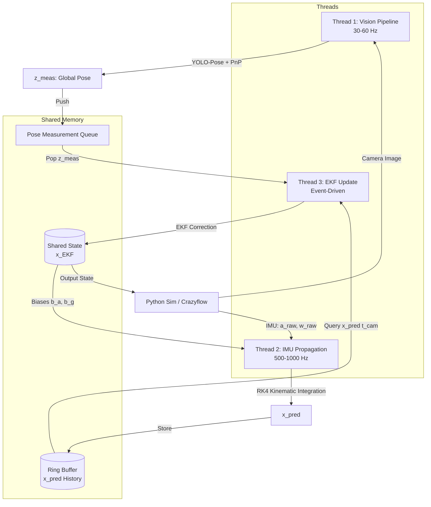

# Autonomous Drone Racing Perception & State Estimation (VIO)

This repository contains a simplified, high-performance Visual-Inertial Odometry (VIO) and state estimation pipeline designed for testing autonomous drone racing in a simulation environment (e.g., Python Crazyflie/Crazyflow).

The pipeline combines a keypoint-based visual detector (YOLO-Pose + Perspective-n-Point) with a high-rate Extended Kalman Filter (EKF) in a concurrent C++ architecture.

---

## 1. System Architecture

The pipeline runs on a 3-thread concurrent architecture in C++ to achieve low-latency predictions and event-driven updates.



### Component Details
1. **Thread 1: Vision (30-60 Hz)**
   - Receives raw monocular camera frames.
   - Runs **YOLO-Pose** (ONNX Runtime) to extract 4 inner gate corners.
   - Computes relative camera-to-gate transform ($R_{CG}, t_{CG}$) via **PnP** solver.
   - Transforms relative pose to global coordinates using a pre-loaded gate map to produce $z_{meas} = [p_{meas}, q_{meas}]^T$.
   - Pushes measurement and camera timestamp to the thread-safe queue.

2. **Thread 2: IMU Propagation (500-1000 Hz)**
   - Polls high-frequency accelerometer and gyroscope measurements.
   - Compensates for biases ($b_a, b_g$) from the latest EKF state.
   - Integrates kinematics forward using **Runge-Kutta 4th Order (RK4)**.
   - Writes predictions ($x_{pred}$) to a timestamp-indexed ring buffer.

3. **Thread 3: EKF Update (Event-Driven)**
   - Blocks until a pose measurement ($z_{meas}$) is available in the queue.
   - Queries the ring buffer for the predicted state matching the camera capture timestamp ($t_{cam}$).
   - Computes the innovation residual ($y = z_{meas} - h(x_{pred})$).
   - Computes Kalman gain ($K$), updates the system covariance ($P$), and applies the correction to the global state $x_{EKF}$.
   - Publishes the updated state for controller usage and feedback.

---

## 2. State & Mathematical Representation

### 16D System State Vector ($x \in \mathbb{R}^{16}$)
$$x = \begin{bmatrix} p_{WB} \\ v_W \\ q_{WB} \\ b_a \\ b_g \end{bmatrix}$$
* $p_{WB} \in \mathbb{R}^3$: Position of the drone's Body frame relative to the World frame.
* $v_W \in \mathbb{R}^3$: Linear velocity in World coordinates.
* $q_{WB} \in \text{SO}(3)$ (4D unit quaternion): Orientation rotating from Body to World.
* $b_a, b_g \in \mathbb{R}^3$: Accelerometer and gyroscope sensor biases.

### 15D Error State Vector ($\delta x \in \mathbb{R}^{15}$)
To avoid quaternion singularities and over-parameterization, the EKF tracks error states:
$$\delta x = \begin{bmatrix} \delta p \\ \delta v \\ \delta \theta \\ \delta b_a \\ \delta b_g \end{bmatrix}$$
where $\delta \theta \in \mathbb{R}^3$ is the orientation rotational error vector.

---

## 3. Simulation & IPC Protocol
The C++ VIO pipeline communicates with the Python-based drone simulator (Crazyflow) using UDP sockets. 

- **Python to C++**: 
  - Send IMU packages (`timestamp, ax, ay, az, gx, gy, gz`) at high rate.
  - Send Camera frames (encoded JPEG bytes) at 30 Hz.
- **C++ to Python**: 
  - Send EKF state packages (`pos[3], vel[3], quat[4], bias_a[3], bias_g[3]`) back to Python for closed-loop control.

---

## 4. Development Roadmap & Implementation Details

- [x] **Phase 1: Synthetic Dataset & YOLO-Pose Training**
  - [x] Write Python synthetic data generator using raw UZH background frames.
  - [x] Auto-project 3D gate corners using Kannala-Brandt fisheye camera distortion.
  - [x] Write training script (`simulation/train_yolo.py`) to train the model and export to ONNX.

### Phase 1 Technical Details

#### 1. Synthetic Dataset Generation (`simulation/generate_synthetic_gates.py`)
To train YOLO-Pose without manual labeling, we synthesize a training dataset directly from the UZH-FPV background images:
* **Backgrounds**: We sample raw frames from the UZH dataset where the gate is not visible or use arbitrary scenes.
* **3D Gate Projection**: A virtual square gate ($1.5\text{m} \times 1.5\text{m}$ with a $0.08\text{m}$ border thickness) is placed in 3D relative to the camera frame ($Z$-forward, $X$-right, $Y$-down).
* **Fisheye Lens Distortion**: To match the real Davis240C camera lens, we project the 3D corners onto the 2D plane using the **Kannala-Brandt (equidistant) distortion model**:
  $$\theta = \arctan(r)$$
  $$\theta_d = \theta(1 + k_1\theta^2 + k_2\theta^4 + k_3\theta^6 + k_4\theta^8)$$
  where $k_1, k_2, k_3, k_4$ are the calibrated distortion coefficients.
* **Augmentations**: Randomizes rotation, translation, gate color intensity, and applies Gaussian/motion blur to simulate high-speed flight.
* **Output**: Writes 1,200 training and 150 validation images directly in YOLO-Pose format (`class_idx x_center y_center w h kp1_x kp1_y kp1_v ...`) to `datasets/yolo_gate/`.

#### 2. YOLO-Pose Training (`simulation/train_yolo.py`)
* Loads the lightweight `yolo11n-pose.pt` model.
* Trains on the synthetic dataset for 30 epochs (automatically selecting CUDA if available).
* Exports the final model to **ONNX format** with dynamic axes, ready to be loaded by the C++ pipeline.

- [ ] **Phase 2: C++ Pipeline Core**
  - [ ] Implement thread-safe queues and ring buffers.
  - [ ] Integrate ONNX Runtime for YOLO-Pose inference.
  - [ ] Implement OpenCV PnP localization solver.
- [ ] **Phase 3: EKF State Fusion**
  - [ ] Implement RK4 IMU kinematics integrator.
  - [ ] Implement EKF update step with delay compensation.
- [ ] **Phase 4: Closed-Loop Simulation Testing**
  - [ ] Set up UDP socket communications.
  - [ ] Run test flights in Python simulator using C++ estimates.

---

## 5. UZH-FPV Dataset Details

Our validation pipeline leverages the following local dataset:

* **Dataset Reference**: [UZH-FPV Quadcopter Dataset: Indoor Forward-Facing (DAVIS-3 APS) Baseline](https://fpv.ifi.uzh.ch/datasets/)
* **Visual Sensor**: Monochromatic APS (Active Pixel Sensor) global shutter frames (640x480 resolution) extracted from a neuromorphic DAVIS240C camera sensor.
* **IMU & Ground-Truth**: High-rate (~500 Hz) IMU linear accelerations and angular velocities synchronized with millimeter-accurate Leica laser optical ground truth.
* **Directory Structure**:
  ```text
  datasets/
  └── uzh-fpv-indoor-forward-davis3/
      ├── calib/           # Sensor chain camera & IMU calibration (YAML)
      ├── events.txt       # Event stream log (optional)
      ├── groundtruth.txt  # Leica-sync 6DoF Ground Truth poses
      ├── images.txt       # Frame timestamp-to-file index mapping
      ├── img/             # Folder containing raw camera frame images (.png)
      ├── imu.txt          # High frequency 500Hz Accelerometer & Gyro logs
      └── leica.txt        # raw Leica MS60 coordinate records
  ```

---

## 6. Weights Organization & Git Tracking

To keep the repository clean and avoid committing large binary PyTorch models while keeping the C++ production model tracked:
* **Tracked Model**: `weights/best.onnx` (ONNX model, ~10.5 MB, used directly by C++ inference).
* **Ignored Weights**: `weights/*.pt` (PyTorch model weights used for training/validation in Python, excluded via `.gitignore`).

---

## 7. Model Training & Validation Guide

### How to Train the YOLO-Pose Model
To re-run the training process on the synthetic dataset:
```bash
# Ensure the virtual environment is used
venv/bin/python simulation/train_yolo.py
```
This script downloads a base model, trains on `datasets/yolo_gate/` (synthesized automatically from UZH background frames and fisheye parameters), and exports the model to ONNX.

### How to Test on Real UZH-FPV Images
To run inference on the raw UZH-FPV images and inspect results:
```bash
venv/bin/python simulation/test_on_uzh.py
```

* **Quantitative Log**: Output coordinates and confidence scores are written to `simulation/runs/uzh_test_results.txt`.
* **Visual Verification**: Annotated frames with bounding box and gate corner overlays are saved to `simulation/runs/detections/`.

### Validation Results (Real-World Test)
When tested on the raw, real-world FPV frames (sampling every 20th frame):
* **Model Used**: `weights/best.pt`
* **Real Frames with Gate Detections**: 10 frames out of 105 tested (confidence > 0.5)
* **Max Detection Confidence**: **78.3%** on `image_0_322.png` (proving successful Sim-to-Real domain transfer).


