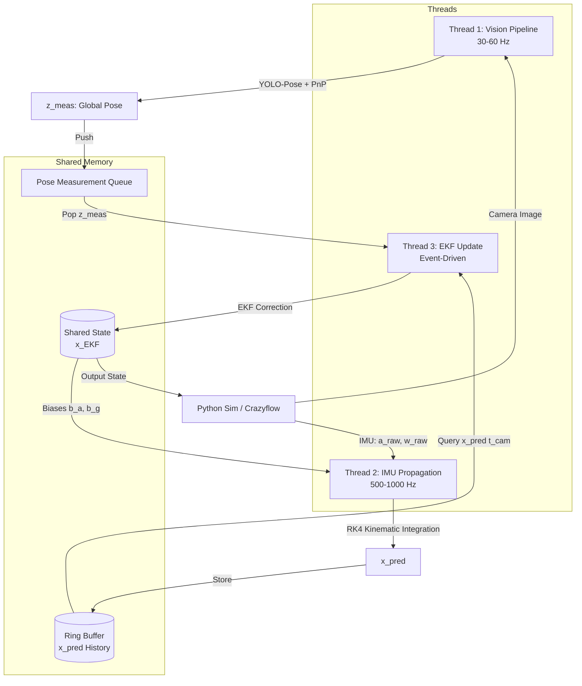

# Autonomous Drone Racing Perception & State Estimation (VIO)

This repository contains a simplified, high-performance Visual-Inertial Odometry (VIO) and state estimation pipeline designed for testing autonomous drone racing in a simulation environment (e.g., Python Crazyflie/Crazyflow).

The pipeline combines a keypoint-based visual detector (YOLO-Pose + Perspective-n-Point) with a high-rate Extended Kalman Filter (EKF) in a concurrent C++ architecture.

---

## 1. System Architecture

The pipeline runs on a 3-thread concurrent architecture in C++ to achieve low-latency predictions and event-driven updates.

### Component Details
1. **Thread 1: Vision (30-60 Hz)**
   - Receives raw monocular camera frames.
   - Runs **YOLO-Pose** (ONNX Runtime) to extract 4 inner gate corners.
   - Computes relative camera-to-gate transform ($R_{CG}, t_{CG}$) via **PnP** solver.
   - Transforms relative pose to global coordinates using a pre-loaded gate map to produce $z_{meas} = [p_{meas}, q_{meas}]^T$.
   - Pushes measurement and camera timestamp to the thread-safe queue.

2. **Thread 2: IMU Propagation (500-1000 Hz)**
   - Polls high-frequency accelerometer and gyroscope measurements.
   - Compensates for biases ($b_a, b_g$) from the latest EKF state.
   - Integrates kinematics forward using **Runge-Kutta 4th Order (RK4)**.
   - Writes predictions ($x_{pred}$) to a timestamp-indexed ring buffer.

3. **Thread 3: EKF Update (Event-Driven)**
   - Blocks until a pose measurement ($z_{meas}$) is available in the queue.
   - Queries the ring buffer for the predicted state matching the camera capture timestamp ($t_{cam}$).
   - Computes the innovation residual ($y = z_{meas} - h(x_{pred})$).
   - Computes Kalman gain ($K$), updates the system covariance ($P$), and applies the correction to the global state $x_{EKF}$.
   - Publishes the updated state for controller usage and feedback.

---

## 2. State & Mathematical Representation

### 16D System State Vector ($x \in \mathbb{R}^{16}$)
$$x = \begin{bmatrix} p_{WB} \\ v_W \\ q_{WB} \\ b_a \\ b_g \end{bmatrix}$$
* $p_{WB} \in \mathbb{R}^3$: Position of the drone's Body frame relative to the World frame.
* $v_W \in \mathbb{R}^3$: Linear velocity in World coordinates.
* $q_{WB} \in \text{SO}(3)$ (4D unit quaternion): Orientation rotating from Body to World.
* $b_a, b_g \in \mathbb{R}^3$: Accelerometer and gyroscope sensor biases.

### 15D Error State Vector ($\delta x \in \mathbb{R}^{15}$)
To avoid quaternion singularities and over-parameterization, the EKF tracks error states:
$$\delta x = \begin{bmatrix} \delta p \\ \delta v \\ \delta \theta \\ \delta b_a \\ \delta b_g \end{bmatrix}$$
where $\delta \theta \in \mathbb{R}^3$ is the orientation rotational error vector.

---

## 3. Simulation & IPC Protocol
The C++ VIO pipeline communicates with the Python-based drone simulator (Crazyflow) using UDP sockets. 

- **Python to C++**: 
  - Send IMU packages (`timestamp, ax, ay, az, gx, gy, gz`) at high rate.
  - Send Camera frames (encoded JPEG bytes) at 30 Hz.
- **C++ to Python**: 
  - Send EKF state packages (`pos[3], vel[3], quat[4], bias_a[3], bias_g[3]`) back to Python for closed-loop control.

---

## 4. Development Roadmap

- [ ] **Phase 1: Synthetic Dataset & YOLO-Pose Training**
  - [ ] Write Python simulator image collection script.
  - [ ] Auto-label keypoints based on simulator ground-truth gate corners.
  - [ ] Train YOLO-Pose model (PyTorch) and export to ONNX format.
- [ ] **Phase 2: C++ Pipeline Core**
  - [ ] Implement thread-safe queues and ring buffers.
  - [ ] Integrate ONNX Runtime for YOLO-Pose inference.
  - [ ] Implement OpenCV PnP localization solver.
- [ ] **Phase 3: EKF State Fusion**
  - [ ] Implement RK4 IMU kinematics integrator.
  - [ ] Implement EKF update step with delay compensation.
- [ ] **Phase 4: Closed-Loop Simulation Testing**
  - [ ] Set up UDP socket communications.
  - [ ] Run test flights in Python simulator using C++ estimates.
