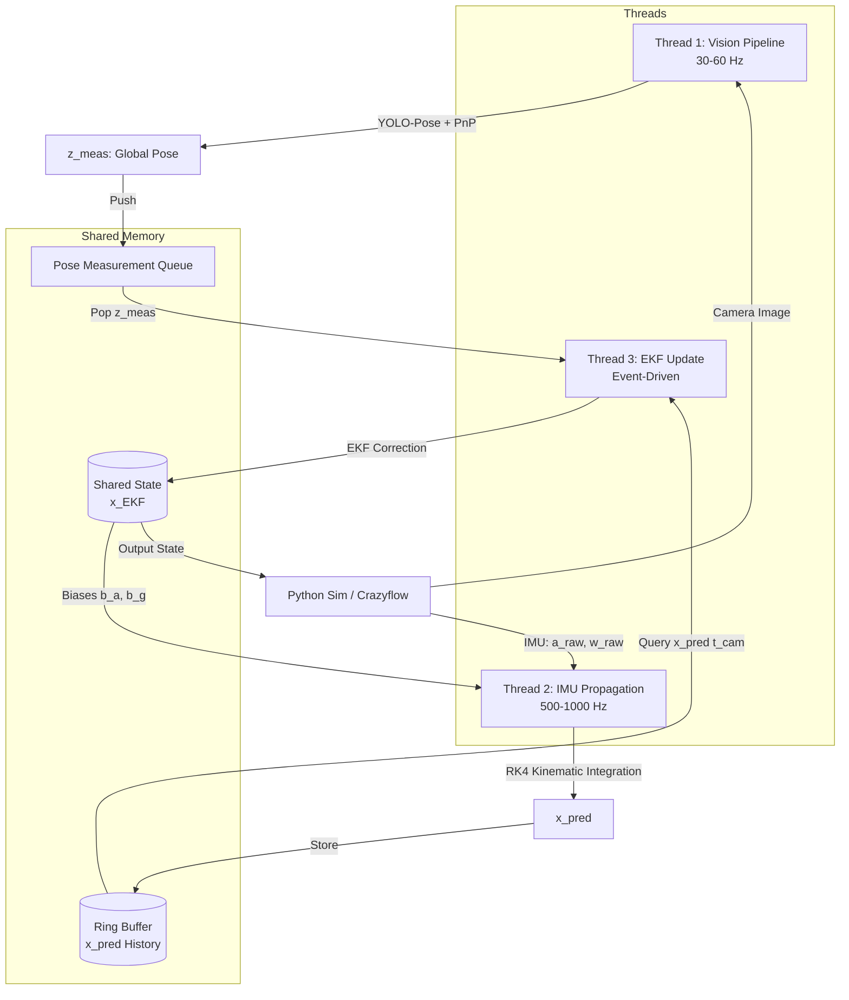

# Autonomous Drone Racing Perception & State Estimation (VIO)

This repository contains a simplified, high-performance Visual-Inertial Odometry (VIO) and state estimation pipeline designed for testing autonomous drone racing in a simulation environment (e.g., Python Crazyflie/Crazyflow).

The pipeline combines a keypoint-based visual detector (YOLO-Pose + Perspective-n-Point) with a high-rate Extended Kalman Filter (EKF) in a concurrent C++ architecture.

---

## 1. System Architecture

The pipeline runs on a 3-thread concurrent architecture in C++ to achieve low-latency predictions and event-driven updates.



### Component Details
1. **Thread 1: Vision (30-60 Hz)**
   - Receives raw monocular camera frames.
   - Runs **YOLO-Pose** (ONNX Runtime) to extract 4 inner gate corners.
   - Computes relative camera-to-gate transform ($R_{CG}, t_{CG}$) via **PnP** solver.
   - Transforms relative pose to global coordinates using a pre-loaded gate map to produce $z_{meas} = [p_{meas}, q_{meas}]^T$.
   - Pushes measurement and camera timestamp to the thread-safe queue.

2. **Thread 2: IMU Propagation (500-1000 Hz)**
   - Polls high-frequency accelerometer and gyroscope measurements.
   - Compensates for biases ($b_a, b_g$) from the latest EKF state.
   - Integrates kinematics forward using **Runge-Kutta 4th Order (RK4)**.
   - Writes predictions ($x_{pred}$) to a timestamp-indexed ring buffer.

3. **Thread 3: EKF Update (Event-Driven)**
   - Blocks until a pose measurement ($z_{meas}$) is available in the queue.
   - Queries the ring buffer for the predicted state matching the camera capture timestamp ($t_{cam}$).
   - Computes the innovation residual ($y = z_{meas} - h(x_{pred})$).
   - Computes Kalman gain ($K$), updates the system covariance ($P$), and applies the correction to the global state $x_{EKF}$.
   - Publishes the updated state for controller usage and feedback.

---

## 2. State & Mathematical Representation

### 16D System State Vector ($x \in \mathbb{R}^{16}$)
$$x = \begin{bmatrix} p_{WB} \\ v_W \\ q_{WB} \\ b_a \\ b_g \end{bmatrix}$$
* $p_{WB} \in \mathbb{R}^3$: Position of the drone's Body frame relative to the World frame.
* $v_W \in \mathbb{R}^3$: Linear velocity in World coordinates.
* $q_{WB} \in \text{SO}(3)$ (4D unit quaternion): Orientation rotating from Body to World.
* $b_a, b_g \in \mathbb{R}^3$: Accelerometer and gyroscope sensor biases.

### 15D Error State Vector ($\delta x \in \mathbb{R}^{15}$)
To avoid quaternion singularities and over-parameterization, the EKF tracks error states:
$$\delta x = \begin{bmatrix} \delta p \\ \delta v \\ \delta \theta \\ \delta b_a \\ \delta b_g \end{bmatrix}$$
where $\delta \theta \in \mathbb{R}^3$ is the orientation rotational error vector.

---

## 3. Simulation & IPC Protocol
The C++ VIO pipeline communicates with the Python-based drone simulator (Crazyflow) using UDP sockets. 

- **Python to C++**: 
  - Send IMU packages (`timestamp, ax, ay, az, gx, gy, gz`) at high rate.
  - Send Camera frames (encoded JPEG bytes) at 30 Hz.
- **C++ to Python**: 
  - Send EKF state packages (`pos[3], vel[3], quat[4], bias_a[3], bias_g[3]`) back to Python for closed-loop control.

---

## 4. Development Roadmap & Implementation Details

- [x] **Phase 1: Synthetic Dataset & YOLO-Pose Training**
  - [x] Write Python synthetic data generator using raw UZH background frames.
  - [x] Auto-project 3D gate corners using Kannala-Brandt fisheye camera distortion.
  - [x] Write training script (`simulation/train_yolo.py`) to train the model and export to ONNX.

### Phase 1 Technical Details

#### 1. Synthetic Dataset Generation (`simulation/generate_synthetic_gates.py`)
To train YOLO-Pose without manual labeling, we synthesize a training dataset directly from the UZH-FPV background images:
* **Backgrounds**: We sample raw frames from the UZH dataset where the gate is not visible or use arbitrary scenes.
* **3D Gate Projection**: A virtual square gate ($1.5\text{m} \times 1.5\text{m}$ with a $0.08\text{m}$ border thickness) is placed in 3D relative to the camera frame ($Z$-forward, $X$-right, $Y$-down).
* **Fisheye Lens Distortion**: To match the real Davis240C camera lens, we project the 3D corners onto the 2D plane using the **Kannala-Brandt (equidistant) distortion model**:
  $$\theta = \arctan(r)$$
  $$\theta_d = \theta(1 + k_1\theta^2 + k_2\theta^4 + k_3\theta^6 + k_4\theta^8)$$
  where $k_1, k_2, k_3, k_4$ are the calibrated distortion coefficients.
* **Augmentations**: Randomizes rotation, translation, gate color intensity, and applies Gaussian/motion blur to simulate high-speed flight.
* **Output**: Writes 1,200 training and 150 validation images directly in YOLO-Pose format (`class_idx x_center y_center w h kp1_x kp1_y kp1_v ...`) to `datasets/yolo_gate/`.

#### 2. YOLO-Pose Training (`simulation/train_yolo.py`)
* Loads the lightweight `yolo11n-pose.pt` model.
* Trains on the synthetic dataset for 30 epochs (automatically selecting CUDA if available).
* Exports the final model to **ONNX format** with dynamic axes, ready to be loaded by the C++ pipeline.

##### Training Metrics & Progress

The table below summarizes the key training and validation metrics recorded across the 30 epochs (from [results.csv](file:///home/aaron/Documents/perception/simulation/runs/results.csv)):

| Epoch | Train Box Loss | Val Box Loss | Train Pose/Keypoint Loss | Val Pose/Keypoint Loss | Box mAP50 | Box mAP50-95 | Pose mAP50 | Pose mAP50-95 |
| :---: | :---: | :---: | :---: | :---: | :---: | :---: | :---: | :---: |
| 1 | 1.1984 | 0.7089 | 3.6466 | 2.2203 | 0.9572 | 0.8129 | 0.9572 | 0.5018 |
| 5 | 0.6624 | 0.5227 | 0.4967 | 0.2752 | 0.9944 | 0.8804 | 0.9944 | 0.9711 |
| 10 | 0.5578 | 0.4340 | 0.3349 | 0.1506 | 0.9949 | 0.9102 | 0.9949 | 0.9914 |
| 15 | 0.5011 | 0.3658 | 0.2624 | 0.1113 | 0.9950 | 0.9302 | 0.9950 | 0.9926 |
| 20 | 0.4392 | 0.3146 | 0.2068 | 0.0816 | 0.9950 | 0.9595 | 0.9950 | 0.9929 |
| 25 | 0.2805 | 0.2742 | 0.0677 | 0.0631 | 0.9950 | 0.9683 | 0.9950 | 0.9944 |
| 30 | 0.2343 | 0.2322 | 0.0540 | 0.0465 | 0.9950 | 0.9781 | 0.9950 | 0.9950 |

> [!NOTE]
> * The final model achieves **97.8%** Box mAP50-95 and **99.5%** Pose/Keypoint mAP50-95 on the validation set, demonstrating high precision on synthetic data before deploying to the C++ pipeline.
> * A visual plot of all metrics is saved at [results.png](file:///home/aaron/Documents/perception/simulation/runs/results.png).

- [x] **Phase 2: C++ Pipeline Core**
  - [x] Implement thread-safe queues and ring buffers.
  - [x] Integrate ONNX Runtime for YOLO-Pose inference.
  - [x] Implement OpenCV PnP localization solver.

#### Phase 2 Technical Details

The core C++ components are implemented in the [cpp_pipeline](file:///home/aaron/Documents/perception/cpp_pipeline) directory.

#### 1. File-Wise & Function-Wise Architecture

##### A. Shared Types & Concurrency Buffers ([pipeline_utils.h](file:///home/aaron/Documents/perception/cpp_pipeline/include/pipeline_utils.h))
Consolidates all structures and thread-safe buffers required for cross-thread data propagation:
* **Common Structs**:
  * `DetectionResult`: Holds `cv::Rect bbox`, float `confidence`, and `std::vector<cv::Point2f> keypoints` (4 corners: Top-Left, Top-Right, Bottom-Right, Bottom-Left).
  * `PoseMeasurement`: Holds the computed 3D global position (`Eigen::Vector3d position`) and attitude (`Eigen::Quaterniond quaternion`) representing $z_{meas}$ at a given `double timestamp`.
  * `KinematicState`: Holds the 16D EKF state vectors. Contains `to_vector()` and `from_vector()` to convert to/from raw `Eigen::Matrix<double, 16, 1>` vectors.
* **`ThreadSafeQueue<T>`**:
  * `push(const T& value)` / `push(T&& value)`: Mutex-locked push that notifies waiting threads via `std::condition_variable`.
  * `pop()`: Blocking pop that waits until elements are available.
  * `pop_with_timeout(std::chrono::milliseconds timeout)`: Blocks with timeout, returning `std::nullopt` if it expires.
  * `try_pop()`: Non-blocking pop.
* **`RingBuffer`**:
  * `insert(const KinematicState& state)`: Enforces monotonic timestamps and appends a new predicted state to the deque, popping old elements to maintain a maximum size of 2000.
  * `get_state_at(double timestamp)`: Performs binary search (`std::lower_bound`) to find the two closest states. Translates position, velocity, and biases using linear interpolation, and rotates attitude using Spherical Linear Interpolation (**SLERP**), returning the latency-compensated historical state.

###### B. Unified Vision Pipeline ([vision_pipeline.h](file:///home/aaron/Documents/perception/cpp_pipeline/include/vision_pipeline.h) / [vision_pipeline.cpp](file:///home/aaron/Documents/perception/cpp_pipeline/src/vision_pipeline.cpp))
Implements the `VisionPipeline` class, merging YOLO-Pose ONNX inference, PnP localization, and gate matching:
* **`VisionPipeline(...)`**: Constructor that initializes ONNX Runtime Session, extracts input/output node dimensions, and defines the local 3D inner gate corners ($1.5\text{m} \times 1.5\text{m}$ inner dimensions).
* **`detect_and_solve_relative_pose(...)`** (Private Helper): Executes preprocessing, model execution, NMS candidate filtering, keypoint scaling to full-frame space, equidistant distortion correction (`cv::fisheye::undistortPoints`), and IPPE PnP relative transform solving ($R_{rel}$, $t_{rel}$).
* **`process_frame(...)`**: Fuses relative transform with camera-to-body extrinsics ($R_{CB}$, $t_{CB}$) and a specific known gate pose to yield absolute drone pose ($p_{meas}$, $q_{meas}$).
* **`process_frame_with_gate_matching(...)`**: Takes the pre-loaded track map and EKF predicted drone position ($p_{pred}$). Fuses the relative transform with all gate poses in the track map and selects the gate that minimizes $\|p_{meas} - p_{pred}\|$. Outliers are rejected if this distance exceeds a threshold (`max_match_distance`).

##### C. Verification Runner ([verify_pipeline.cpp](file:///home/aaron/Documents/perception/cpp_pipeline/src/verify_pipeline.cpp))
* **`main(...)`**: Loads parameters and the test frame [image_0_322.png](file:///home/aaron/Documents/perception/datasets/uzh-fpv-indoor-forward-davis3/img/image_0_322.png). Invokes:
  1. `process_frame` using a known gate target.
  2. `process_frame_with_gate_matching` using a candidate gate map to perform closest-state nearest-gate lookup.
  3. `RingBuffer` and `EKF` test propagations and updates.

---

#### 2. Compilation, Execution & Verification Guide

Follow these steps to compile and verify the consolidated C++ pipeline:

##### Step 1: Install Dependencies
Ensure you have the required build tools and libraries installed on your Debian/Ubuntu system:
```bash
# Install CMake, compiler, OpenCV, and ONNX Runtime headers
sudo apt-get update && sudo apt-get install -y cmake libopencv-dev libonnxruntime-dev

# Install Eigen3 library (required for matrix and vector mathematics)
sudo apt-get install -y libeigen3-dev
```

##### Step 2: Build the Project
Configure and compile the project using CMake:
```bash
cd cpp_pipeline
mkdir -p build && cd build
cmake ..
make -j4
```
This builds the static library `libperception_pipeline.a` and links it to compile the `verify_pipeline` binary.

##### Step 3: Run the Verification Program
Run the executable to run the entire pipeline on a sample image:
```bash
./verify_pipeline
```
This test:
1. Loads the ONNX model and the sample UZH frame.
2. Extracts 2D gate corners, undistorts them, solves PnP, and transforms them into global coordinates.
3. Outputs the estimated drone state vector measurements.
4. Performs verification tests on the EKF RingBuffer's SLERP interpolation.
- [x] **Phase 3: EKF State Fusion**
  - [x] Implement RK4 IMU kinematics integrator.
  - [x] Implement EKF update step with delay compensation.

#### Phase 3 Technical Details

The EKF sensor fusion pipeline is implemented in [ekf.h](file:///home/aaron/Documents/perception/cpp_pipeline/include/ekf.h) and [ekf.cpp](file:///home/aaron/Documents/perception/cpp_pipeline/src/ekf.cpp).

##### 1. State Representation & Covariance
* **Nominal State**: Fuses accelerometer and gyroscope readings to maintain a 16D state vector containing 3D position ($p_{WB}$), 3D velocity ($v_W$), unit quaternion attitude ($q_{WB}$), 3D accelerometer bias ($b_a$), and 3D gyroscope bias ($b_g$).
* **Error State (15D)**: Tracks position error ($\delta p$), velocity error ($\delta v$), orientation error ($\delta \theta$), accelerometer bias error ($\delta b_a$), and gyroscope bias error ($\delta b_g$).
* **Covariance propagation**: Uses a 15x15 error covariance matrix $P$.

##### 2. Runge-Kutta 4th Order Kinematic Integration (`predict()`)
Computes nominal state propagation by integrating continuous equations of motion over a micro-timestep $dt$ using RK4:
* Zero-mean bias-corrected inputs: $a_{corr} = a_{raw} - b_a$, and $\omega_{corr} = \omega_{raw} - b_g$.
* State derivative equations:
  * $\dot{p} = v$
  * $\dot{v} = R(q_{WB}) a_{corr} + g_W$ (NED world gravity $g_W = [0, 0, 9.81]^T$)
  * $\dot{q} = \frac{1}{2} q_{WB} \otimes \omega_{corr}$
* Transition matrix propagation: Updates $P_{k} = F P_{k-1} F^T + Q$ with error-state transition matrix $F$ and discrete-time process noise $Q$.

##### 3. Joseph-Form Measurement Update (`update()`)
Executes Kalman correction using delay-compensated pose measurements:
* **Residual calculation**: Computes 6D innovation residual $y$:
  * Position residual: $y_p = p_{meas} - p_{hist}$
  * Orientation residual: $y_\theta = 2 \cdot \text{vec}(q_{hist}^{-1} \otimes q_{meas})$ (with negative coefficient correction for shortest path rotation).
* **Kalman Gain**: Computes $K = P H^T (H P H^T + R)^{-1}$ using a 6x15 measurement Jacobian matrix $H$ and 6x6 measurement noise matrix $R$.
* **Joseph-Form Covariance Update**: Ensures numerical stability and matrix symmetry:
  $$P \leftarrow (I - KH) P (I - KH)^T + K R K^T$$
  $$P \leftarrow \frac{1}{2} (P + P^T)$$
- [ ] **Phase 4: Closed-Loop Simulation Testing**
  - [ ] Set up UDP socket communications.
  - [ ] Run test flights in Python simulator using C++ estimates.

---

## 5. UZH-FPV Dataset Details

Our validation pipeline leverages the following local dataset:

* **Dataset Reference**: [UZH-FPV Quadcopter Dataset: Indoor Forward-Facing (DAVIS-3 APS) Baseline](https://fpv.ifi.uzh.ch/datasets/)
* **Visual Sensor**: Monochromatic APS (Active Pixel Sensor) global shutter frames (640x480 resolution) extracted from a neuromorphic DAVIS240C camera sensor.
* **IMU & Ground-Truth**: High-rate (~500 Hz) IMU linear accelerations and angular velocities synchronized with millimeter-accurate Leica laser optical ground truth.
* **Directory Structure**:
  ```text
  datasets/
  └── uzh-fpv-indoor-forward-davis3/
      ├── calib/           # Sensor chain camera & IMU calibration (YAML)
      ├── events.txt       # Event stream log (optional)
      ├── groundtruth.txt  # Leica-sync 6DoF Ground Truth poses
      ├── images.txt       # Frame timestamp-to-file index mapping
      ├── img/             # Folder containing raw camera frame images (.png)
      ├── imu.txt          # High frequency 500Hz Accelerometer & Gyro logs
      └── leica.txt        # raw Leica MS60 coordinate records
  ```

---

## 6. Weights Organization & Git Tracking

To keep the repository clean and avoid committing large binary PyTorch models while keeping the C++ production model tracked:
* **Tracked Model**: `weights/best.onnx` (ONNX model, ~10.5 MB, used directly by C++ inference).
* **Ignored Weights**: `weights/*.pt` (PyTorch model weights used for training/validation in Python, excluded via `.gitignore`).

---

## 7. Model Training & Validation Guide

### How to Train the YOLO-Pose Model
To re-run the training process on the synthetic dataset:
```bash
# Ensure the virtual environment is used
venv/bin/python simulation/train_yolo.py
```
This script downloads a base model, trains on `datasets/yolo_gate/` (synthesized automatically from UZH background frames and fisheye parameters), and exports the model to ONNX.

### How to Test on Real UZH-FPV Images
To run inference on the raw UZH-FPV images and inspect results:
```bash
venv/bin/python simulation/test_on_uzh.py
```

* **Quantitative Log**: Output coordinates and confidence scores are written to `simulation/runs/uzh_test_results.txt`.
* **Visual Verification**: Annotated frames with bounding box and gate corner overlays are saved to `simulation/runs/detections/`.

### Validation Results (Real-World Test)
When tested on the raw, real-world FPV frames (sampling every 20th frame):
* **Model Used**: `weights/best.pt`
* **Real Frames with Gate Detections**: 10 frames out of 105 tested (confidence > 0.5)
* **Max Detection Confidence**: **78.3%** on `image_0_322.png` (proving successful Sim-to-Real domain transfer).


